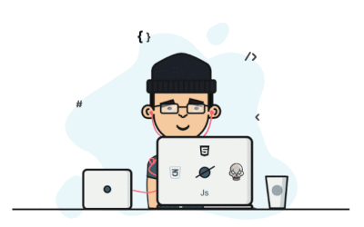

  <h1>Hi there, I'm Sumit Jungi </h1>
  
  

    
  

  

    <b>Dreaming up ideas and bringing them to life with elegant, high-performance interfaces.</b>
  

  
  

    &nbsp;&nbsp;
    &nbsp;&nbsp;
    
  

  

---

### 👨‍💻 About Me & Services

I am a passionate, self-taught software engineer specializing in **production-grade, industry-level solutions**. I take great care in code quality, system architecture, and building highly scalable platforms.

**Here is what I can build for you:**

- **High-Performance Full-Stack Apps:** Delivering seamless web and mobile experiences using Node.js, React, Vite, Angular, Bun, and Ionic/Capacitor.
- **GenAI & RAG Platforms:** Integrating LLMs, Azure OpenAI, and vector databases into custom SaaS products (like automated bidding/proposal platforms).
- **IoT & Hardware Integration:** Engineering connected device solutions and edge computing applications using Raspberry Pi, seamlessly bridging physical hardware with scalable cloud backends.
- **Scalable Architecture:** Moving applications from local environments to production-ready Kubernetes deployments and multi-node clusters.
- **Advanced UIs:** Building complex, high-performance frontends, virtualized masonry grids (using TanStack Virtual), and dynamic theming.

---

### 🛠️ Tech Stack & Tools

  

 

**Backend & Scripting:**  

&nbsp;
&nbsp;
&nbsp;

 

**Languages & Frontend Frameworks:**  

&nbsp;
&nbsp;
&nbsp;
&nbsp;
&nbsp;
&nbsp;
 

**Mobile & Hybrid:**  

&nbsp;
&nbsp;
&nbsp;

 

**Databases & Cloud:**  

&nbsp;
&nbsp;
&nbsp;
&nbsp;
&nbsp;

 

**Architecture, DevOps & Management:**  

&nbsp;
&nbsp;
&nbsp;

 

**OS, CLI & Hardware:**  

&nbsp;
&nbsp;
&nbsp;
&nbsp;

<!-- ---
### 📊 GitHub Analytics

  
  

 -->
 

  <i>Let's build something amazing together. Reach out via <a href="mailto:sumit.jungi@gmail.com">Email</a> or <a href="https://www.linkedin.com/in/sumitjungi/">LinkedIn</a>!</i>

